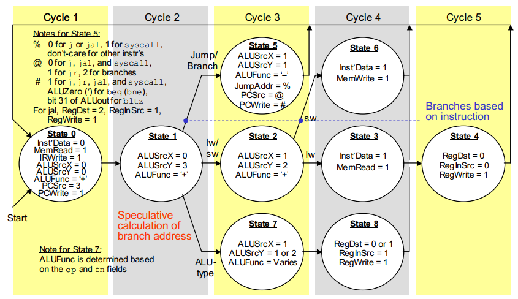

## Description
Following code is implementated based on these Diagrams. For detailed explanation on the Instruction Set and Philosophy behind Multi Cycle Datapath of MicroMIPS go through the book "Computer Architecture" by Behrooz Parhami.
#
## Key Elements of MicroMIPS Multi-Cycle Datapath

## Control State Diagram of Multicycle MicroMIPS

#
##### Images from book -> "Computer Architecture" - Behrooz Parhami
